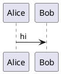

```markdown
# ZimX Spec: Native PlantUML Rendering (Local JAR)

## Summary
Add native PlantUML support to ZimX using a local `plantuml.jar` renderer, with:
- Automatic discovery of `plantuml.jar` (and Java) from common locations / PATH
- A Settings UI to explicitly set the JAR path when discovery fails
- PlantUML syntax highlighting inside fenced Markdown code blocks using existing Pygments integration
- Diagram rendering to **SVG** for crisp scaling and easy copy/export

## Goals
- Render diagrams from fenced Markdown blocks:  
```



````
- Produce SVG output suitable for:
- in-app preview
- copy/export for pasting into other tools (e.g., draw.io)
- Keep rendering local (no network dependency)

## Non-Goals
- PlantUML Server/Kroki support (future enhancement)
- Full PlantUML language validation or linting beyond render errors
- Editing diagrams in a separate dedicated diagram editor (keep in-text for now)

---

## User Stories
1. As a user, when I include a ` ```plantuml ` code block, I see the diagram rendered in preview.
2. As a user, if PlantUML isn’t configured, I get a clear error with a shortcut to Settings.
3. As a user, I can set the location of `plantuml.jar` once and it “just works” thereafter.
4. As a user, diagrams look crisp at any zoom level (SVG).
5. As a user, I can export the rendered SVG for use elsewhere.

---

## Requirements

### R1: Code Block Detection
- Recognize fenced code blocks where the info string is:
- `plantuml` (primary)
- Optional aliases: `puml`, `uml` (nice-to-have)
- Preserve the raw code content exactly as written.

### R2: Syntax Highlighting (Editor)
- Within fenced PlantUML code blocks, apply syntax highlighting using existing Pygments pipeline.
- Highlighting scope is limited to the code block region (no global lexer switching).

### R3: Local Rendering Backend
- Render using `java` + `plantuml.jar`
- Output must be **SVG**
- Rendering should support:
- `-tsvg`
- `-pipe` (preferred; avoids temp input files)
- If `-pipe` is not used, fallback to temp `.puml` and output `.svg`.

### R4: JAR Discovery + Configuration
- ZimX attempts to locate `plantuml.jar` automatically by:
1. If user configured a jar path in settings, use it
2. Else, search known locations (configurable list), e.g.:
   - `$PATH` (if user provides a wrapper script named `plantuml`)
   - Common install paths (Linux/Mac/Windows)
   - ZimX app resources folder (if you later decide to bundle it)
- ZimX must provide a Settings field:
- “PlantUML JAR Path” (file picker)
- “Test” button that runs a tiny sample diagram and shows success/failure

### R5: Java Availability
- ZimX should detect if `java` is callable.
- If Java is missing, show a clear action message:
- “Java not found. Install a JRE/JDK or set JAVA_HOME / PATH.”

### R6: Preview Rendering + Caching
- Render diagrams in preview pane as embedded SVG.
- Cache rendered SVG by content hash:
- Key = sha256(diagram_text + jar_path + renderer_version + options)
- Cache location:
- ZimX cache directory (not inside the wiki pages)
- Re-render occurs when:
- PlantUML block text changes
- JAR path changes
- render options change

### R7: UX + Actions
For each rendered diagram in preview:
- Show diagram
- Provide context actions:
- “Copy SVG”
- “Save SVG As…”
- “Open cache file location” (optional)
If rendering fails:
- Show an error block with:
- short error summary
- expandable “Details” (stderr/stdout)
- “Open Settings” shortcut

### R8: Performance / Responsiveness
- Rendering must not block the UI thread.
- Use a debounced render trigger (e.g., 300–750ms after last edit inside block).
- Cancel in-flight render if the block text changes again.

### R9: Security/Safety
- Do not execute arbitrary shell commands; invoke `java` with argument array (no shell).
- Treat diagram text as untrusted input:
- (Optional) allow disabling `!include` if you want to prevent file reads.
- At minimum: document that PlantUML can include external/local files depending on config.

---

## Settings

### Settings Keys
- `plantuml.enabled` (bool, default true)
- `plantuml.jar_path` (string, default empty -> auto-discover)
- `plantuml.java_path` (string, optional; default empty -> use `java` in PATH)
- `plantuml.render.format` (enum: `svg` only for now)
- `plantuml.render.debounce_ms` (int, default 500)

### Settings UI
- Checkbox: Enable PlantUML rendering
- Text field + Browse: PlantUML JAR Path
- (Optional) Text field + Browse: Java Path
- Button: “Test PlantUML Setup”
- Runs sample diagram -> returns SVG -> shows “OK” and timing
- On error: show stderr and recommended fix

---

## Rendering Pipeline (High Level)

1. Markdown parser identifies fenced PlantUML blocks and extracts their raw text.
2. For preview:
 - compute cache key
 - if cached: embed SVG
 - else:
   - queue render job (async)
   - on completion: store SVG in cache + refresh preview
3. For editor:
 - Pygments highlighting applied to PlantUML block regions

---

## CLI Invocation (Expected)
Preferred (stdin):
- `java -jar /path/to/plantuml.jar -tsvg -pipe`
- Input: diagram text
- Output: SVG bytes on stdout
- Errors: stderr

Fallback (temp file):
- Write temp `.puml`
- `java -jar plantuml.jar -tsvg /tmp/diagram.puml`
- Read resulting `.svg`

---

## Error Handling
- Missing JAR:
- “PlantUML not configured. Set plantuml.jar location in Settings.”
- Missing Java:
- “Java not found. Install Java or configure java path.”
- Render failure:
- Display stderr in collapsible details
- Keep previous cached render visible (optional) with “stale” badge

---

## Acceptance Criteria
- A Markdown file containing a ` ```plantuml ` block renders an SVG diagram in preview.
- If jar path is unset, ZimX attempts discovery; if it fails, user can set jar path in Settings.
- PlantUML blocks are syntax highlighted in the editor using Pygments.
- Rendering is async (UI remains responsive while rendering).
- Caching prevents re-rendering unchanged diagrams.
- “Test PlantUML Setup” reliably reports configuration success/failure.

---

## Test Plan

### Unit Tests
- Fence detection (`plantuml`, aliases if added)
- Cache key generation
- Settings precedence (explicit path overrides discovery)

### Integration Tests
- Render sample diagram via jar -> verify SVG output contains `<svg`
- Render error diagram -> verify user-facing error block + stderr captured
- Change block text -> verify cache miss triggers new render

### Manual QA
- Large diagram performance
- Multiple diagrams on one page
- Switching jar path invalidates cache
- Copy/Save SVG actions work on Windows/Linux

---

## Future Enhancements (Backlog)
- Add server rendering backend (Kroki/PlantUML-server)
- Add PNG export option
- Add “Open in external PlantUML viewer” command
- Advanced security toggles (disable includes, restrict include paths)
- Diagram toolbar in preview (zoom, download, copy)
```
::contentReference[oaicite:0]{index=0}
````


-----


UPDATES:

New Updates:
- don't automatically render any diagrams.  
- remove plantuml tab.  
- unhook any events from a plantuml code block in the main editor.

In its place:
- add a right click mouse option on the attachments tab 'Add new PlantUML...'
  - ask for a name
  - write <name>.puml in the attachments folder
- double clicking a .puml file in the attachments folder opens the puml viewer.

PUML viewer:
- a new window should pop up over the main window and should take most of the screen.
- non modal, tab can switch to other focuses if necessary
- This should have a puml editor on the left (35%) and a image previewer on the right (65%) with a slidable divider.
- both panels can be zoomed with +/- functionality
- when ctrl-s is pressed to (save) this triggers a update the rendering.
- right click on the image:
  - Copy as SVG
  - Copy as PNG


----- AI Updates

the puml editor will have these updates:

the left rail of the editor will have line numbers (up to three digits) fixed widh and right justified/padded.

the bottom 20% of the editor window will be a new ai chat message panel that looks like the one on the ai-chat panel and has just a 'send' button with same icon.

above the editor is a quick edit helper drop down that gets its values from puml_shortcuts.json.  when one of these is selected it appends the sample puml at the cursor position in editor (new line if in the middle of a line).

when a message is sent on the chat panel, a chat is sent to the default ai server and model with the puml_prompt.txt

system prompt: <puml_prompt.txt>
user:  <curent contents of editor> + '\n' + user chat request

The output will over show in the main editor window in a different color background with a option to "Accept | Decline" inline.  If accept is chosen it replaces the editor buffer, saves, and rerenders the diagram.

