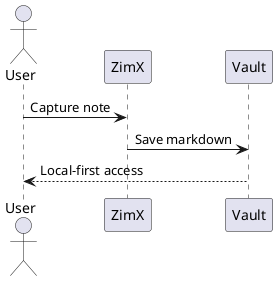

# YouTube Script Draft: "ZimX in 15 Minutes — From Zero to Power User"

## Video Goals
- Introduce ZimX to brand new users and show why it feels different.
- Demonstrate core workflows end-to-end using real notes.
- Cover all major features without overwhelming the viewer.

## Suggested Flow (High-Level)
1. Hook + promise (0:00-0:45)
2. What ZimX is and why it matters (0:45-1:45)
3. Create/open a vault and orient the UI (1:45-3:00)
4. Editing basics + Markdown live formatting (3:00-5:00)
5. Focus mode vs audience mode (5:00-5:45)
6. Links + navigation + backlinks (5:45-7:15)
7. Two ways to use ZimX (7:15-8:15)
8. Search + replace (8:15-9:00)
9. Tasks + checkboxes (9:00-10:00)
10. Calendar + journal pages (10:00-11:00)
11. Tags + filters (11:00-12:00)
12. Attachments + images (12:00-13:00)
13. AI helpers: one-shot vs page vs global (13:00-14:30)
14. PlantUML diagrams (14:30-15:15)
15. Keyboard + focus tools (15:15-16:00)
16. Advanced setups: remote + web client + offline (16:00-17:00)
17. Wrap-up + next steps (17:00-17:30)

## Script Draft (Voice + On-Screen)

### 0:00-0:45 — Hook
**Voice:** "If you want a notes app that stays local-first, feels fast, and still lets you link, tag, task, and even use AI when you choose, this is ZimX. In the next 15 minutes I'll show you everything you need to go from zero to fluent."
**On-screen:** ZimX opening. Quick montage: linked notes, tasks, tags, journal, AI menu.

### 0:45-1:45 — What ZimX Is
**Voice:** "ZimX is built on simple folders and Markdown files. Your vault is just a folder on disk. That means your notes stay yours, work offline, and never get locked in. ZimX just makes them feel fast, connected, and easy to grow."
**On-screen:** Show file explorer with a vault folder. Open a Markdown file in a text editor for 1 second, then back to ZimX.

### 1:45-3:00 — Create or Open a Vault
**Voice:** "Let's start fresh. Go to Vault, Open Vault, and choose a folder. ZimX reads the folder tree and builds your navigation on the left. Every page you create becomes a normal `.md` file."
**On-screen:** Menu click: Vault -> Open Vault. Choose folder `ZimX Demo Vault`. Left sidebar populates.
**On-screen Note:** Create a new page named `Home`.

### 3:00-5:00 — Editing Basics
**Voice:** "Editing is plain Markdown with live formatting. Type a title as a heading, then add bullets, bold, italics, and checkboxes. You can use keyboard shortcuts for speed."
**On-screen:** Type:
```md
# Home

Welcome to my ZimX vault.

## Projects
- [ ] Ship the alpha
- [ ] Collect feedback

**Bold**, *italic*, and `code`.
```
**On-screen:** Use Ctrl+B / Ctrl+I, show heading shortcuts briefly.
**Voice:** "Everything stays readable in any Markdown editor."

### 5:00-5:45 — Focus Mode vs Audience Mode
**Voice:** "ZimX has two reading modes that change how you work. Focus mode is for writing and thinking. It trims the UI so you can stay in flow. Audience mode is for presenting or sharing on screen, with a clean, readable layout."
**On-screen:** Toggle focus mode, then audience mode. Show the difference in chrome and readability.

### 5:45-7:15 — Links + Navigation + Backlinks
**Voice:** "ZimX shines when you link your notes. Create a new page by linking to it. Use labels to keep links readable. Backlinks show where a page is referenced so you never lose context."
**On-screen:** Type:
```
See [:Project Plan|the plan].
```
Click to create `Project Plan`. Show backlinks panel for `Project Plan`.
**Voice:** "Jump fast with quick navigation, and move through your graph without leaving the keyboard."

### 7:15-8:15 — Two Ways to Use ZimX
**Voice:** "There are two common ways people set up ZimX, and both are first-class."
**Voice:** "Mode one: calendar as home base. This is perfect for day workers like consultants and lawyers. Your journal page is the running log of the day, and every meeting, task, or doc links out from there."
**On-screen:** Open today’s journal. Add sections: `## Calls`, `## Decisions`, `## Next Actions`, each with links to pages.
**Voice:** "Mode two: links and structure as home base. Writers, researchers, and students often live in the left nav and backlinks. Your ideas grow into a network of pages that link, cite, and evolve."
**On-screen:** Show a folder tree for `Drafts`, `Sources`, `Chapters`. Navigate via backlinks and quick links.

### 8:15-9:00 — Search + Replace
**Voice:** "Need to find anything fast? Use the find bar for forward, backward, and case-sensitive searches. Replace one or all."
**On-screen:** Trigger find, search for "Project", replace with "Launch".

### 9:00-10:00 — Tasks + Checkboxes
**Voice:** "Tasks are just Markdown checkboxes, but ZimX treats them like first-class citizens. Toggle tasks with a click or shortcut, and watch your task views update."
**On-screen:** Toggle a task. Show task list view or filter if available.

### 10:00-11:00 — Calendar + Journals
**Voice:** "For daily work, open the journal. ZimX can create dated pages and templates so your daily log is one click away."
**On-screen:** Open calendar view, click today, show a daily note created from a template.

### 11:00-12:00 — Tags + Filters
**Voice:** "Tags help you organize across folders. Add a tag like `@meeting` or `@idea`, then filter the vault to see everything connected."
**On-screen:** Add tags in a note, use tag filter or search to show results.

### 12:00-13:00 — Attachments + Images
**Voice:** "Drop in attachments or images directly. ZimX stores them locally and links them inside your note."
**On-screen:** Drag an image into the note, show inline preview. Drag a PDF and show link.

### 13:00-14:30 — AI Helpers (Opt-In)
**Voice:** "AI in ZimX is optional and explicit. You choose exactly what to send and when. There are three ways to use it depending on your workflow."
**Voice:** "One-shot prompts are inline actions. Select a paragraph and ask for a summary, a rewrite, or a list of action items. It is fast, scoped, and leaves your note in control."
**On-screen:** Select a paragraph, open AI menu, choose "Summarize selection", insert result.
**Voice:** "Page chat is for sustained work on a single note. Use it when you are building a plan, drafting a page, or refining a doc. The chat stays attached to that page."
**On-screen:** Open a page chat panel for `Project Plan`, ask for risks and tradeoffs, add a bullet list.
**Voice:** "Global chat is for broad questions across your vault. Use it when you want direction or patterns across multiple notes. You can also choose local or remote providers depending on your privacy needs."
**On-screen:** Open global chat, ask "What are open tasks across the vault?", show a short response.

### 14:30-15:15 — PlantUML Diagrams
**Voice:** "ZimX supports PlantUML right inside your notes, which is perfect for quick system sketches or process flows."
**On-screen:** Add a section in `Project Plan`:
````md
## Architecture Sketch


````
**On-screen:** Rendered diagram appears; toggle edit/preview briefly.

### 15:15-16:00 — Keyboard + Focus Tools
**Voice:** "ZimX stays fast because it is keyboard-friendly. Use shortcuts for headings, links, and navigation. Focus tools keep you in flow, and read-only mode helps when you're reviewing."
**On-screen:** Quick keyboard tour: link creation, heading picker, read-only toggle.

### 16:00-17:00 — Advanced Setup (Tech)
**Voice:** "If you need multi-device access, connect a remote vault. For quick access from anywhere, use the web client. And because ZimX is offline-first, local vaults keep working even without a network."
**On-screen:** Show remote vault connect screen, then a quick web client view, then offline note edit.

### 17:00-17:30 — Wrap-Up + Next Steps
**Voice:** "That is ZimX from zero to power user: local Markdown notes, fast linking, tasks, tags, journals, and optional AI. If you want to keep learning, check the built-in Help Vault and start with Getting Started."
**On-screen:** Open Help Vault, highlight Getting Started, Editing Basics, Navigation.

## Shot List / B-Roll Prompts
- Folder view showing `.md` files in a vault.
- Quick montage: backlinks panel, tag filter, calendar, task list, AI menu.
- Drag-and-drop image and attachment.
- Remote vault connect screen + web client.

## Recording Notes
- Keep pace brisk; total runtime ~15 minutes.
- Use the same demo vault throughout for continuity.
- If a feature is behind a menu, show the path once, then use shortcuts.
